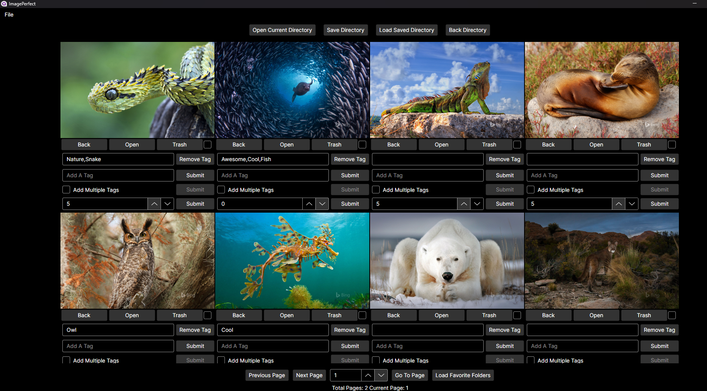
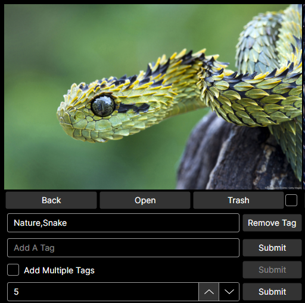
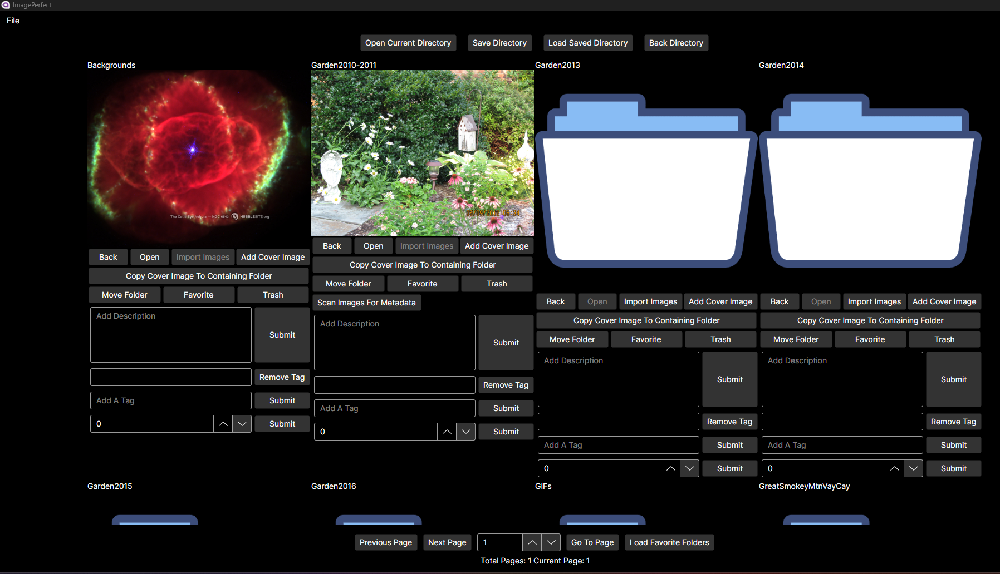
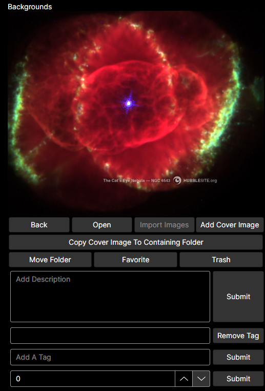

# Image Perfect

## 📚 Table Of Contents
- 🚀 [Quick Start Windows](#quick-start-windows)
- ℹ️ [About](#about)
- ❓ [Why I Built Image Perfect](#why-i-built-image-perfect)
- 📚 [Tech Stack And Notable Dependencies](#tech-stack-and-notable-dependencies)
- 🖥️ [System Requirements](#system-requirements)
- 👀 [Core Features](#core-features)
- 🧰 [Planned Improvements](#planned-improvements)
- 📷 [Screen Shots](#screen-shots)
- 🖥️ [MySQL Server Setup](#mysql-server-setup)
- 📋 [Build And Install Directions](#build-and-install-directions)
- 📊 [Backing Up And Restoring The MySQL Database](#backing-up-and-restoring-the-mysql-database)
- 📦 [Migrating To A New Computer](#migrating-to-a-new-computer)
- 🔍 [User Guide](#user-guide)
- 🪪 [License](#license)
- 📢 [Feedback And Contributions](#feedback-And-contributions)

<a id="quick-start-windows"></a>
## 🚀 Quick Start Windows

1. [Install MySQL](#mysql-server-setup-windows-end-user) and run provided schema
2. [Download the Windows build](https://github.com/ARogala/ImagePerfectWinX64Build)
3. Run `ImagePerfect.exe`

> See the [User Guide](#user-guide) to begin organizing your images.

<a id="about"></a>
## ℹ️ About

**Image Perfect** is a high-performance, cross-platform (Windows + Ubuntu) image viewer and photo management tool designed for **massive image libraries**. Whether you're organizing thousands or millions of photos, **Image Perfect** stays responsive and efficient.

Written in **C#**, using **Avalonia UI**, **MySQL**, and the **MVVM** pattern, Image Perfect was created to address gaps in existing photo management tools — particularly around performance, usability with large collections, effective file organization, and offering large thumbnails for optimal viewing.

Instead of small, hard-to-see thumbnails and long import times, Image Perfect offers:

- Large adjustable thumbnails (up to 600px wide)
- Fast performance on large libraries
- Rich tagging and folder organization
- Direct image viewing (no thumbnails written to disk)

<a id="why-i-built-image-perfect"></a>
## ❓Why I Built Image Perfect

I created Image Perfect both as a way to learn desktop application development and to solve personal pain points I experienced with existing photo organizers. Many tools struggled with large libraries, relied on tiny thumbnails, consumed excessive amounts of RAM, and were not great at folder organization. Shotwell on Linux came close to meeting my needs, but importing became painfully slow and memory-intensive at scale. This project is my solution to those challenges.

<a id="tech-stack-and-notable-dependencies"></a>
## 📚 Tech Stack And Notable Dependencies

- **UI Framework**: [Avalonia UI](https://github.com/AvaloniaUI/Avalonia)
- **Database**: MySQL using Materialized Path for folder hierarchies
- **ORM**: [Dapper](https://github.com/DapperLib/Dapper)
- **CSV Parsing**: [CsvHelper](https://github.com/JoshClose/CsvHelper)
- **Image Processing**: [SixLabors ImageSharp](https://github.com/SixLabors/ImageSharp)

<a id="system-requirements"></a>
## 🖥️ System Requirements
- Windows 10/11 64 bit or Ubuntu 64 bit
- 8GB Ram (Image Perfect will use about 1GB loading high resolution images)
- Processor -- anything that runs Windows 10/11 will do.

<a id="core-features"></a>
## 👀 Core Features

### 🖼️ Big Thumbnails
- Adjustable image widths from **300px to 600px**
- Images are displayed directly (no caching or writing thumbnails to disk)

### 🏷️ Tagging & ⭐ Rating
- Tag and rate **images and folders**
- Image tags/ratings saved in both the **file** and the **database**
- Folder tags/ratings, and description stored in the **database only**
- Select **cover images** for folders
- Add image tags individually or in bulk (folder bulk tagging planned)
- Folder and image Tags can only be removed one at a time. (bulk remove planned)

### 🗲 Speed with Large Libraries
- **No long import times** thanks to MySqlBulkLoader (insert data from a csv file)
- New folders must be manually added (no auto-monitoring)
	+ To avoid double imports the app will check if you selected folders that are already in the library.
- Metadata scanning is user-initiated
	+ Bulk photo import and metadata scanning per folder or filtered set

### 📂 File System Mirroring
- Move, rename, and manage folders/images inside the app — changes reflected in the file system.
	+ #### Current File System Capabilities
		- Move, create, and delete folders
		- Import newly added folders (images must be present)
		- Delete individual or multiple images
		- Move individual or multiple images
	+ #### File System Capabilities To Add
		- Rename folders and images
		- Re-import images in a folder (so you can add images to a folder from the file system then re-scan)
		
	+ #### File System Issue/Bug
		- Known issue: folders imported containing only ZIP files cannot be opened
		- On Ubuntu folders imported with the same name but different case will show all folders within each folder in both folders. 


### 📷 Shotwell Import
- Import existing tags and ratings from Shotwell (if written to images)

<a id="planned-improvements"></a>
## 🧰 Planned Improvements

- Find duplicate images
- Facial recognition
- Image enhancement tools
- Improved UI design
- SQLite option (to remove server setup)
- Mobile client (view-only)
- Scan for new folders in file system
- Smarter image move operations (handle duplicate filenames)
- Tagging improvements (bulk remove/edit)
- GIF creation support

<a id="screen-shots"></a>
## 📷 Screen Shots

### Images Page



### Image Close Up



### Folders Page



### Folder Close Up



<a id="mysql-server-setup"></a>
## 🖥️ MySQL Server Setup

<a id="#mysql-server-setup-windows-developers"></a>
### Windows Development

> 📌 **Note**: Follow these directions if your a developer and you would like to modify or contribute to Image Perfect 🤠!!

- Download the latest 8.0+ version of MySQL MSI Installer [here](https://dev.mysql.com/downloads/installer/)
- Run the **mysql-installer-community-8.0.42.0.msi** installer
- Click Full 
- Click Next
- Click Execute 
- After Execute keep clicking next and keep default settings
	+ Type and Networking 
	+ Authentication Method 
	+ Accounts and Roles  (KEEP YOUR PW SAFE)
	+ Windows Service 
	+ Server File Permissions 
	+ Apply Configuration Click Execute
	
- Continue through the installer keeping default settings
- After install MySQL Workbench and Shell Should open up

> 📌 **Note**: You now have a MySQL server running and all that is left is to create the database and tables for the application. 

- Open **MySQL Command Line Client** and run the following commands in order.

<a id="create-database-commands"></a>

```
CREATE DATABASE imageperfect;

USE imageperfect;

CREATE TABLE `folders` (
  `FolderId` bigint unsigned NOT NULL AUTO_INCREMENT,
  `FolderName` varchar(200) NOT NULL,
  `FolderPath` varchar(2000) NOT NULL,
  `HasChildren` tinyint(1) DEFAULT NULL,
  `CoverImagePath` varchar(2000) DEFAULT NULL,
  `FolderDescription` varchar(3000) DEFAULT NULL,
  `FolderRating` tinyint unsigned DEFAULT NULL,
  `HasFiles` tinyint(1) DEFAULT NULL,
  `IsRoot` tinyint(1) DEFAULT NULL,
  `FolderContentMetaDataScanned` tinyint(1) DEFAULT NULL,
  `AreImagesImported` tinyint(1) DEFAULT NULL,
  PRIMARY KEY (`FolderId`),
  FULLTEXT KEY `fulltext` (`FolderName`,`FolderPath`,`FolderDescription`)
) ENGINE=InnoDB DEFAULT CHARSET=utf8mb4 COLLATE=utf8mb4_0900_ai_ci;

CREATE TABLE `images` (
  `ImageId` bigint unsigned NOT NULL AUTO_INCREMENT,
  `ImagePath` varchar(2000) NOT NULL,
  `FileName` varchar(500) NOT NULL,
  `ImageRating` tinyint unsigned DEFAULT NULL,
  `ImageFolderPath` varchar(2000) NOT NULL,
  `ImageMetaDataScanned` tinyint(1) DEFAULT NULL,
  `FolderId` bigint unsigned DEFAULT NULL,
  PRIMARY KEY (`ImageId`),
  KEY `FolderId` (`FolderId`),
  FULLTEXT KEY `fulltext` (`ImagePath`),
  CONSTRAINT `images_ibfk_1` FOREIGN KEY (`FolderId`) REFERENCES `folders` (`FolderId`) ON DELETE CASCADE ON UPDATE CASCADE
) ENGINE=InnoDB DEFAULT CHARSET=utf8mb4 COLLATE=utf8mb4_0900_ai_ci;

CREATE TABLE `tags`(
	`TagId` bigint unsigned NOT NULL AUTO_INCREMENT,
	`TagName` Varchar(100) NOT NULL,
	PRIMARY KEY (`TagId`),
	CONSTRAINT `tags_uq` UNIQUE (`TagName`)
) ENGINE=InnoDB DEFAULT CHARSET=utf8mb4 COLLATE=utf8mb4_0900_ai_ci;

CREATE TABLE `folder_tags_join`(
	`FolderId` bigint unsigned NOT NULL,
	`TagId` bigint unsigned NOT NULL,
	PRIMARY KEY (`FolderId`, `TagId`),
	CONSTRAINT `folder_tags_join_idfk_1` FOREIGN KEY (`FolderId`) REFERENCES `folders` (`FolderId`) ON DELETE CASCADE ON UPDATE CASCADE,
	CONSTRAINT `folder_tags_join_idfk_2` FOREIGN KEY (`TagId`) REFERENCES `tags` (`TagId`) ON DELETE CASCADE ON UPDATE CASCADE
) ENGINE=InnoDB DEFAULT CHARSET=utf8mb4 COLLATE=utf8mb4_0900_ai_ci;

CREATE TABLE `image_tags_join`(
	`ImageId` bigint unsigned NOT NULL,
	`TagId` bigint unsigned NOT NULL,
	PRIMARY KEY (`ImageId`, `TagId`),
	CONSTRAINT `image_tags_join_ibfk_1` FOREIGN KEY (`ImageId`) REFERENCES `images` (`ImageId`) ON DELETE CASCADE ON UPDATE CASCADE,
	CONSTRAINT `image_tags_join_ibfk_2` FOREIGN KEY (`TagId`) REFERENCES `tags` (`TagId`) ON DELETE CASCADE ON UPDATE CASCADE

) ENGINE=InnoDB DEFAULT CHARSET=utf8mb4 COLLATE=utf8mb4_0900_ai_ci;

CREATE TABLE `settings` (
	`SettingsId` enum('1') NOT NULL,
	`MaxImageWidth` int unsigned NOT NULL,
	`FolderPageSize` int unsigned NOT NULL,
	`ImagePageSize` int unsigned NOT NULL,
	PRIMARY KEY (`SettingsId`)
) ENGINE=InnoDB DEFAULT CHARSET=utf8mb4 COLLATE=utf8mb4_0900_ai_ci;

INSERT INTO settings (MaxImageWidth, FolderPageSize, ImagePageSize) VALUES (500, 20, 60); 

CREATE TABLE `folder_saved_favorites` (
	`SavedId` bigint unsigned NOT NULL AUTO_INCREMENT,
	`FolderId` bigint unsigned,
	PRIMARY KEY (`SavedId`),
	CONSTRAINT `folderid_uq` UNIQUE (`FolderId`)
) ENGINE=InnoDB AUTO_INCREMENT=19 DEFAULT CHARSET=utf8mb4 COLLATE=utf8mb4_0900_ai_ci;

SET PERSIST local_infile = 1;

```

	
> 📌 **Important**: Make sure to run SET PRESIST local_infile = 1;

<a id="#mysql-server-setup-windows-end-user"></a>
### Windows Server Only

> 📌 **Note**: Follow these directions if you only intend to use the software.

- Download the latest 8.0+ version of MySQL MSI Installer Community Edition [here](https://dev.mysql.com/downloads/installer/)
- Run the **mysql-installer-community-8.0.42.0.msi** installer
- Click **Server only** 
- Click Next
- Click Execute 
- After Execute use these settings
	+ Type and Networking (Manual for Config Type) 
	+ Authentication Method 
	+ Accounts and Roles  (KEEP YOUR PW SAFE)
	+ Windows Service 
	+ Server File Permissions 
	+ Apply Configuration Click Execute
	
- Continue through the installer keeping default settings

> 📌 **Note**: Picking the configuration type **Manual** sets default memory usage for the MySQL server and creates a my.ini configuration file that can be adjusted later for optimal performance. The configuration file is located in C:\ProgramData\MySQL\MySQL Server 8.0 You can read more about this [here](https://dev.mysql.com/doc/mysql-installer/en/server-type-network.html). Leaving defaults should be fine for most libraries and computers. I plan to test this and suggest some optimal settings. 


> 📌 **Note**: You now have a MySQL server running and all that is left is to create the database and tables for the application. 

- Open **MySQL Command Line Client** and run the following [commands](#create-database-commands) in order.

- After running those commands all that is left is to [run](#download-windows-build) Image Perfect.


<a id="build-and-install-directions"></a>
## 📋 Build And Install Directions

- **Important First set up MySQL Server**
- Clone this repository
```
git clone https://github.com/ARogala/ImagePerfect.git
```

### Windows
- Open solution file in Visual Studio
- Right click on project file and click publish
- Set up your publish profile
	- Select local folder publish
	- Configuration: Release | Any CPU
	- Target framework: net8.0
	- Deployment mode: Self-contained
	- Target runtime: win-x64

<a id="download-windows-build"></a>	
Or just download and use the publish files from [here](https://github.com/ARogala/ImagePerfectWinX64Build)

Then to run the application double click on ImagePerfect.exe or you could also right click the exe and send to desktop as a shortcut.

> 📌 **Note**: If your MySql password (pwd) and user (uid) differs from what is in the appsettings.json file in this repository. You must change it.

```
{
  "ConnectionStrings": {
    "DefaultConnection": "server=127.0.0.1;uid=root;pwd=your-passowrd;database=imageperfect;AllowLoadLocalInfile=true"
  }
}
```

> 🔐 **Security Note**: Never commit your real MySQL credentials to source control.

### Ubuntu
- Open solution file in Visual Studio
- Right click on project file and click publish
- Set up your publish profile
	- Select local folder publish
	- Configuration: Release | Any CPU
	- Target framework: net8.0
	- Deployment mode: Self-contained
	- Target runtime: linux-x64
	
Copy the publish files from your Windows PC to your Linux one. Or just use JetBrains Rider in Linux. The steps will be almost the same.
	
Or just download and use the publish files from [here](https://github.com/ARogala/ImagePerfectLinuxX64Build)

Then to run just open terminal in the build folder and run this command
```
./ImagePerfect
```

> 📌 **Note**: If your MySql password (pwd) and user (uid) differs from what is in the appsettings.json file in this repository. You must change it.

```
{
  "ConnectionStrings": {
    "DefaultConnection": "server=127.0.0.1;uid=root;pwd=your-password;database=imageperfect;AllowLoadLocalInfile=true"
  }
}
```

> 🔐 **Security Note**: Never commit your real MySQL credentials to source control.

<a id="backing-up-and-restoring-the-mysql-database"></a>
## 📊 Backing Up And Restoring The MySQL Database

### Windows
We will use mysqldump command to do this.

**Important:** ImagePerfect stores file paths in the database, so your image files must remain in the **same locations** (drive letter, folder paths, etc.) for a restore to work.

1. Open **Command Prompt** (not PowerShell) and navigate to your MySQL bin directory:
```
cd C:\Program Files\MySQL\MySQL Server 8.0\bin
```
2. **To back up**: 
```
mysqldump -u root -p imageperfect > C:\MySQLBackup\imageperfect_YYYY_MM_DD.sql
```

- It will ask for your root server password after hitting enter.
- Your back up SQL file will now be in C:\MySQLBackup check and ensure it is there.


3. **To restore**:
```
mysql -u root -p imageperfect < C:\MySQLBackup\imageperfect_YYYY_MM_DD.sql
```

- It will ask for your root server password after hitting enter.
- Your database should now be restored.
	
NOTE: It would be best to try this before spending too much time organizing your photos in the app. Make sure you can back up before wasting time. Its easy to spend hours adding cover images, tags, and notes about the event/day.

### Ubuntu

This is basically the same as Windows

1. Open a terminal in your desired backup location.
2. **To back up**:
```
sudo mysqldump imageperfect > imageperfect_YYYY_MM_DD.sql
```

- Ubuntu will ask for your root password after hitting enter.
- This will dump the imageperfect database in the backup location.
	
3. **To restore**:
```
sudo mysql imageperfect < imageperfect_YYYY_MM_DD.sql
```

- Ubuntu will ask for your root password after hitting enter.
- Your database should now be restored.
- Obvious or maybe not, but terminal should be opened in the location/folder where your backup file is located for the restore to work.

<a id="migrating-to-a-new-computer"></a>
## 📦 Migrating To A New Computer

- Install and configure MySQL then build the app as usual
- Restore the database as described above
- Ensure all image files are restored to the **same location and drive letter/path** as before

<a id="user-guide"></a>
## 🔍 User Guide

The best way to get started is to run the app and explore. But here’s a guided overview of the core features.

### 📂 Importing the Library Structure

**To start building your library:**

- **File ➡️ Pick Library Folder** 
- Select the root folder that contains all your image folders
- Image Perfect will scan the folder structure (but not import images yet)
	+ If you have a large library this will take some time to import your folder structure
	
> 💡 **Tip**: Image Perfect works best when your photo collection is already organized into meaningful folders. Avoid dumping thousands of images into a single folder.
	

### 🗑️ Deleting the Library

- **File ➡️ Delete Library**

This removes the MySQL database but **does not delete your image files** from the file system.
	
### ➕ Adding New Folders 

You can add additional folders to your library after initial import.

- **File ➡️ Add New Folders**
- Select one or more new folders from the file system 
- The app will skip any folder that has already been imported

> 📌 **Note Known issue**: folders imported containing only ZIP files cannot be opened. So ensure your new folders contain only images jpg, png, gif etc.
	
### 🖼️ Importing Images & Scanning Metadata

**Importing images** loads file paths into the MySQL database.  
**Scanning metadata** reads tags and ratings from image files (e.g., written by Shotwell) and stores them in the database.

> 📌 **Note**: Metadata is *not* scanned and images are *not* imported during the initial library import for speed.

#### 📂 Per-Folder Import/Scan

- Click **Import Images** button on a specific folder to load all image paths into the database
- Click **Scan Images for Metadata** button on a specific folder to extract tags/ratings from image files.

> 📌 **Note**: You have to **Import Images** first before the scan metadata button appears.

#### 📦 Bulk Import & Scan

- **File ➡️ Import and Scan** to open the bulk toolbar
- Use these buttons on the current page of folders:

| Button                                 | Description                        |
|----------------------------------------|------------------------------------|
| **Import All Folders On Current Page** | Quickly imports all images for folders on the page |
| **Scan All Folders On Current Page**   | Scans all images for metadata (Takes longer) |
| **Add Cover Image On Current Page**    | Picks a random image as a folder cover (must import images first) |

> ⏱️ **Performance Tip**:  
> Scanning metadata can be time-consuming on large pages. Use a folder pagination size of 40–60 for best balance.  
> A page size of 100 folders may take 10–30 minutes depending on number of images, image resolution, and computer specs.

#### 🔍 Filter-Based Bulk Actions

- **File ➡️ Filters ➡️ Get Folders With Images Not Imported**
- **File ➡️ Filters ➡️ Get Folders With Metadata Not Scanned**

Optionally check **"Filter in Current Directory"**, then run the corresponding import/scan button from the **Import and Scan** toolbar.

### 🧭 Navigation 

Image Perfect was designed to mirror the file system so navigation will mostly be intuitive. However, there are a lot of buttons within the app and the pagination feature adds some complexity so getting used to navigating may take a bit. Navigation is done with a combination of on folder and on image buttons as well as two, always visible, toolbars.

#### Top Directory Navigation Toolbar

> 📌 **Note**: This is the directory navigation toolbar. It aids in directory navigation.

> 📌 **Note**: To open a directory in app you have to click the **Open** button located on each folder.

| Button                     | Description                                    |
|----------------------------|------------------------------------------------|
| **Open Current Directory** | Opens the current directory in your file system |
| **Save Directory**         | Saves the current directory and page number for quick navigation back to this location |
| **Load Saved Directory**   | Opens the user selected saved directory |
| **Back Directory**         | Goes back one directory |

#### Bottom Pagination Navigation Toolbar

> 📌 **Note**: This is the pagination navigation toolbar. It aids in loading the *Next* or *Previous* page of images and folders within the current directory.

| Button             | Description                                            |
|--------------------|--------------------------------------------------------|
| **Previous Page**  | Loads the previous page of images or folders within the current directory |
| **Next Page**      | Loads the next page of images or folders within the current directory |
| **Go To Page**     | Loads the user selected page of images or folders within the current directory |
| **Load Favorites** | Loads your favorite folders | 

#### 📂 Folder Navigation Buttons

On each folder there is an **Open** and **Back** button. **Open** opens that folder/directory. **Back** goes back one folder/directory. 

#### 🖼️ Image Navigation Buttons

On each image there is a **Back** button. **Back** goes back one folder/directory.

> 📌 **Note**: The **Open** button on each image is to open the image with an external image viewer. On Windows PC this requires you to  install [nomacs](https://nomacs.org/). On Ubuntu PC this feature will use the default [eog](https://manpages.ubuntu.com/manpages/trusty/man1/eog.1.html) image viewer.

> 📌 **Note**: You could also click **Back Directory** on the top toolbar

### 📂 Create a New Folder

- **File ➡️ Create New Folder** to open the new folder toolbar
- Type the name of the desired new folder and click **Create Folder** button

> 📌 **Note**: You can only create new folders once you navigate into your library. You cannot create a new folder at the root location. This feature is useful if you want to move some images from one folder to a new one within the app.

### 🔍 Filters

- **File ➡️ Filters** to open the filters toolbar

| Button | Description |
|--------|-------------|
| **Filter Images On Rating**| Gets all images at the selected rating. 1-5 star ⭐ | 
| **Filter Folders On Rating** | Gets all folders at the selected rating. 1-10 star ⭐ |
| **Filter Images On Tags** | Gets all the images with the selected tag. |
| **Filter Folders On Tags** | Gets all the folders with the selected tag. |
| **Search Folder Description** | Gets all folders that match the search term. This will search the Folder Name, Folder Description, and Folder Path in the database. |
| **Load Current Directory** | Loads the current directory. Useful if filter does not return any results. |
| **Filter in Current Directory** | Check the box to apply the filter only in the current directory. Unchecked will apply the filter to the entire library. |
| **Get Folders With Images Not Imported** | Gets all folders where images are not yet imported. |
| **Get Folders With Metadata Not Scanned** | Gets all folders where images are imported but metadata is not yet scanned |
| **Get Folders Without Covers** | Gets all folders where images are imported but covers are not yet selected. |

> 📌 **Note**: For tag filters only one tag can be selected. Start typing in the box, and a dropdown will appear with matching tags to select the desired one.

### 🗑️ Clear Favorite Folders

On each folder there is a **Favorite** button. Clicking that will add that folder to a favorite list in the database. There is also a button on the bottom toolbar called **Load Favorite Folders** that button will load all your favorite folders on the screen. To clear your favorites list:

- **File ➡️ Clear Favorite Folders**

> 📌 **Note**: This will just remove that list from the database but the folders will remain in the file system. Also there is no pop up confirm when you click **Clear Favorite Folders** so clicking accidentally will clear them. 

### 🚚 Moving and 🗑️ Deleting Images

- **File ➡️ Manage Images** to open the manage images toolbar
- Open a folder containing images

#### 🚚 Moving Images

- Click **Select Move To Folder** button and choose the folder you want to move images to. 
- Select/Check the images you want moved. (each image has a checkbox)	
- Click **Move Selected** to move the selected images to the desired folder.

#### 🗑️ Deleting Images

There is a **Trash** button on each image. Click that to delete a single image.

- Select/Check the images you want trashed. (each image has a checkbox)
- Click **Trash Selected** to trash the selected images.

> 📌 **Note**: Trashing images and folders just moves them to a folder called "ImagePerfectTRASH". This folder will be created by the app and placed inside your root library folder. 

> 📌 **Note**: There is also a **Select All** button that will select and deselect all the images on the page.

### Total 🖼️ Image Count

To get the total number of images currently imported in your library.

- **File ➡️ Total Images**

### Show All Tags 🏷️

To view a list of all the tags currently in use; either on images or folders.

- **File ➡️ Show All Tags**

### ⚙️ Settings

- **File ➡️ Settings** to open the settings toolbar

| Radio Button | Description |
|--------|-------------|
| **Pick Image Width**| Select the radio buttons to adjust the desired image and folder width. From 300px to 600px |
| **Pick Folder Pagination Size** | Select the radio buttons to adjust the number of folders that appear on each page. From 20 - 100 folders |
| **Pick Image Pagination Size** | Select the radio buttons the adjust the number of images that appear on each page. From 20 - 200 images |

<a id="license"></a>
## 🪪 License

**Image Perfect** is licensed under the **GNU Affero General Public License v3.0 (AGPL-3.0)**.

You are free to use, modify, and distribute this software under the terms of the AGPL. If you modify and publicly distribute the software — including via a hosted service — you must make your source code available under the same license.

<a id="feedback-And-contributions"></a>
## 📢 Feedback And Contributions

I'm always open to feedback, feature suggestions, or contributions. Please feel free to open issues or pull requests.


 


