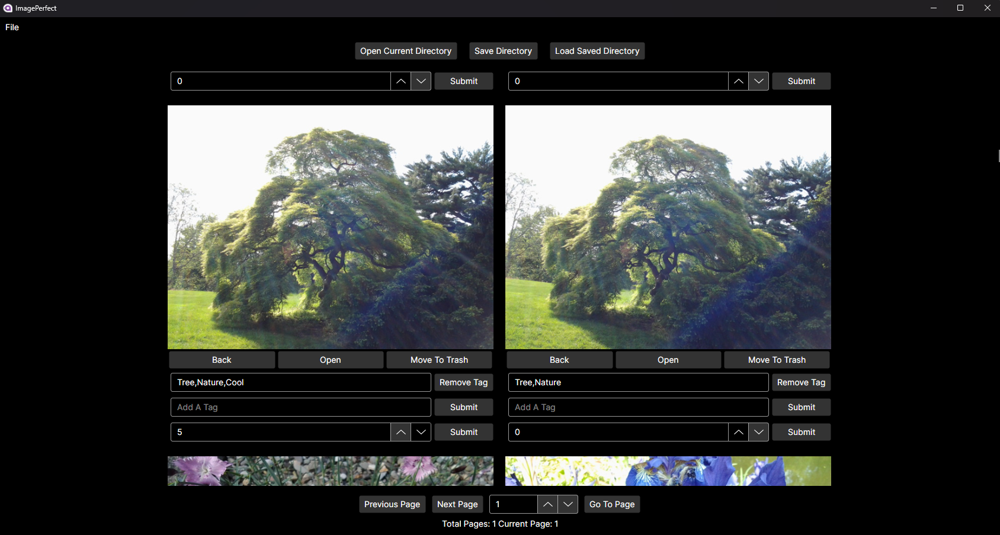

# Image Perfect

# Table Of Contents
- [About](#item-one)
- [Why I Built Image Perfect](#item-two)
- [Tech Stack & Notable Dependencies](#item-three)
- [System Requirements](#item-four)
- [Core Features](#item-five)
- [Planned Improvements](#item-six)
- [Screen Shot](#item-seven)
- [MySQL Server Setup](#item-eight)
- [Build and Install Directions](#item-nine)
- [Backing Up & Restoring the MySQL Database](#item-ten)
- [Migrating To A New Computer](#item-eleven)
- [User Guide](#item-twelve)
- [License](#item-thirteen)
- [Feedback & Contributions](#item-fourteen)

<a id="item-one"></a>
## About

**Image Perfect** is a high-performance, cross-platform (Windows + Ubuntu) image viewer and photo management system designed for **massive libraries** — capable of handling **hundreds of thousands to millions of images** with ease.

Written in **C#**, using **Avalonia UI**, **MySQL**, and the **MVVM** pattern, Image Perfect was created to address gaps in existing photo management tools — particularly around performance, usability with large collections, effective file organization, and offering large thumbnails for optimal viewing.

Instead of small, hard-to-see thumbnails and long import times, Image Perfect offers:

- Large adjustable thumbnails (up to 600px wide)
- Fast performance on for large libraries
- Rich tagging and folder organization
- Direct image viewing (no thumbnails written to disk)

<a id="item-two"></a>
## Why I Built Image Perfect

I created Image Perfect both as a way to learn desktop application development and to solve personal pain points I experienced with existing photo organizers. Many tools struggled with large libraries, relied on tiny thumbnails, consumed excessive amounts of RAM, and were not great at folder organization. Shotwell on Linux came close to meeting my needs, but importing became painfully slow and memory-intensive at scale. This project is my solution to those challenges.

<a id="item-three"></a>
## Tech Stack & Notable Dependencies

- **UI Framework**: [Avalonia UI](https://github.com/AvaloniaUI/Avalonia)
- **Database**: MySQL using Materialized Path for folder hierarchies
- **ORM**: [Dapper](https://github.com/DapperLib/Dapper)
- **CSV Parsing**: [CsvHelper](https://github.com/JoshClose/CsvHelper)
- **Image Processing**: [SixLabors ImageSharp](https://github.com/SixLabors/ImageSharp)

<a id="item-four"></a>
## System Requirements
- Windows 10/11 64 bit or Ubuntu 64 bit
- 8GB Ram (Image Perfect will use about 1GB loading high resolution images)
- Processor -- anything that runs Windows 10/11 will do.

<a id="item-five"></a>
## Core Features

### Big Thumbnails
- Adjustable image widths from **300px to 600px**
- Images are displayed directly (no caching or writing thumbnails to disk)

### Tagging & Rating
- Tag and rate **images and folders**
- Image tags/ratings saved in both the **file** and the **database**
- Folder tags/ratings, and description stored in the **database only**
- Select **cover images** for folders
- Add image tags individually or in bulk (folder bulk tagging planned)
- Folder and image Tags can only be removed one at a time. (bulk remove planned)

### Speed with Large Libraries
- **No long import times** thanks to MySqlBulkLoader (insert data from a csv file)
- New folders must be manually added (no auto-monitoring)
	+ To avoid double imports the app will check if you selected folders that are already in the library.
- Metadata scanning is user-initiated
	+ Bulk photo import and metadata scanning per folder or filtered set

### File System Mirroring
- Move, rename, and manage folders/images inside the app — changes reflected in the file system.
	+ #### Current File System Capabilities
		- Move, create, and delete folders
		- Import newly added folders (images must be present)
		- Delete individual or multiple images
		- Move individual or multiple images
	+ #### File System Capabilities To Add
		- Rename folders and images
		- Re-import images in a folder (so you can add images to a folder from the file system then re-scan)
		
	+ #### File System Issue/Bug
		- Known issue: folders imported containing only ZIP files cannot be opened


### Shotwell Import
- Import existing tags and ratings from Shotwell (if written to images)

<a id="item-six"></a>
## Planned Improvements

1. Find duplicate images
2. Facial recognition
3. Image enhancement tools
4. Improved UI design
5. SQLite option (to remove server setup)
6. Mobile client (view-only)
7. Scan for new folders in file system
8. Smarter image move operations (handle duplicate filenames)
9. Tagging improvements (bulk remove/edit)
10. GIF creation support

<a id="item-seven"></a>
## Screen Shot



<a id="item-eight"></a>
## MySQL Server Setup

- Setup instructions will be added soon.

<a id="item-nine"></a>
## Build and Install Directions

- **Important First set up MySQL Server**
- Clone this repository
```
git clone https://github.com/ARogala/ImagePerfect.git
```

### Windows
- Open solution file in Visual Studio
- Right click on project file and click publish
- Set up your publish profile
	- Select local folder publish
	- Configuration: Release | Any CPU
	- Target framework: net8.0
	- Deployment mode: Self-contained
	- Target runtime: win-x64
	
Or just download and use the publish files from [here](https://github.com/ARogala/ImagePerfectWinX64Build)

Then to run the application double click on ImagePerfect.exe or you could also right click the exe and send to desktop as a shortcut.

### Ubuntu
- Open solution file in Visual Studio
- Right click on project file and click publish
- Set up your publish profile
	- Select local folder publish
	- Configuration: Release | Any CPU
	- Target framework: net8.0
	- Deployment mode: Self-contained
	- Target runtime: linux-x64
	
Copy the publish files from your Windows PC to your Linux one. Or just use JetBrains Rider in Linux. The steps will be almost the same.
	
Or just download and use the publish files from [here](https://github.com/ARogala/ImagePerfectLinuxX64Build)

Then to run just open terminal in the build folder and run this command
```
./ImagePerfect
```

<a id="item-ten"></a>
## Backing Up & Restoring the MySQL Database

### Windows
We will use mysqldump command to do this.

**Important:** ImagePerfect stores file paths in the database, so your image files must remain in the **same locations** (drive letter, folder paths, etc.) for a restore to work.

1. Open **Command Prompt** (not PowerShell) and navigate to your MySQL bin directory:
```
cd C:\Program Files\MySQL\MySQL Server 8.0\bin
```
2. **To back up**: 
```
mysqldump -u root -p imageperfect > C:\MySQLBackup\imageperfect_YYYY_MM_DD.sql
```

- It will ask for your root server password after hitting enter.
- Your back up sql file will now be in C:\MySQLBackup check and ensure it is there.


3. **To restore**:
```
mysql -u root -p imageperfect < C:\MySQLBackup\imageperfect_YYYY_MM_DD.sql
```

- It will ask for your root server password after hitting enter.
- Your database should now be restored.
	
NOTE: It would be best to try this before spending too much time organizing your photos in the app. Make sure you can back up before wasting time. Its easy to spend hours adding cover images, tags, and notes about the event/day.

### Ubuntu

This is basically the same as Windows

1. Open a terminal in your desired backup location.
2. **To back up**:
```
sudo mysqldump imageperfect > imageperfect_YYYY_MM_DD.sql
```

- Ubuntu will ask for your root password after hitting enter.
- This will dump the imageperfect database in the backup location.
	
3. **To restore**:
```
sudo mysql imageperfect < imageperfect_YYYY_MM_DD.sql
```

- Ubuntu will ask for your root password after hitting enter.
- Your database should now be restored.
- Obvious or maybe not, but terminal should be opened in the location/folder where your backup file is located for the restore to work.

<a id="item-eleven"></a>
## Migrating To A New Computer

- Install and configure MySQL then build the app as usual
- Restore the database as described above
- Ensure all image files are restored to the **same location and drive letter/path** as before

<a id="item-twelve"></a>
## User Guide

- Documentation coming soon

<a id="item-thirteen"></a>
## License

**Image Perfect** is licensed under the **GNU Affero General Public License v3.0 (AGPL-3.0)**.

You are free to use, modify, and distribute this software under the terms of the AGPL. If you modify and publicly distribute the software — including via a hosted service — you must make your source code available under the same license.

<a id="item-fourteen"></a>
## Feedback & Contributions

I'm always open to feedback, feature suggestions, or contributions. Please feel free to open issues or pull requests.


 


