# Image Perfect

## 📚 Table Of Contents
- ⚠️ [Important Metadata Note](#important-metadata-note)
- 🚀 [Quick Start Windows](#quick-start-windows)
- 🚀 [Quick Start Ubuntu](#quick-start-linux)
- ℹ️ [About](#about)
- ❓ [Why I Built Image Perfect](#why-i-built-image-perfect)
- 📚 [Tech Stack And Notable Dependencies](#tech-stack-and-notable-dependencies)
- 🖥️ [System Requirements](#system-requirements)
- 👀 [Core Features](#core-features)
- 🧰 [Planned Improvements](#planned-improvements)
- 📷 [Screen Shots](#screen-shots)
- 🖥️ [MySQL Server Setup Windows](#mysql-server-setup-windows)
- 🖥️ [MySQL Server Setup Ubuntu](#mysql-server-setup-linux)
- 📋 [Build And Install Directions](#build-and-install-directions)
- 📊 [Backing Up And Restoring The MySQL Database](#backing-up-and-restoring-the-mysql-database)
- 📦 [Migrating To A New Computer](#migrating-to-a-new-computer)
- 🔍 [User Guide](docs/USER_GUIDE.md)
- 🪪 [License](#license)
- 📢 [Feedback And Contributions](#feedback-and-contributions)

<a id="important-metadata-note"></a>
## ⚠️ Important Note On Metadata
> Currently, ImagePerfect **only officially supports reading tags and ratings written by Shotwell**, and only if you had Shotwell write that data into the image files themselves (via its “Write Metadata to Files” option).
>
> If that’s your setup, make sure to **scan the folder for metadata before adding or changing ratings/tags** in ImagePerfect.
>
> ImagePerfect is non-destructive, with the **only exception** being that it writes ratings and tags directly into your image files. Scanning first ensures your existing Shotwell data is loaded correctly and helps avoid accidentally overwriting it.

<a id="quick-start-windows"></a>
## 🚀 Quick Start Windows
### Option 1: Easiest Install (Recommended)
1. **Download the Installer**: 📥 Get [ImagePerfect v1.0-beta](https://github.com/BitForgeCraftedCode/ImagePerfect/releases/tag/v1.0-beta)
2. **Run the Installer** and follow the prompts.
3. When prompted by Windows Firewall with "**Allow mysqld.exe**", click Allow (required for the built-in MySQL server to run).
4. Launch **ImagePerfect** from the Start Menu or Desktop shortcut.

> See the [User Guide](#user-guide) to begin organizing your images.

> ⚠️ **Unsigned Installer Notice**
> 
> The current Windows installer is **unsigned**, which may trigger warnings during download or installation.
> To ensure the installer has not been tampered with, please verify its integrity using the SHA-256 hash listed on the [release page](https://github.com/BitForgeCraftedCode/ImagePerfect/releases).
> 
> Example on Windows PowerShell:
> 
> ```powershell
> Get-FileHash ImagePerfectInstaller-v1.0-beta.exe -Algorithm SHA256
> ```
> 
> Compare the output to the hash shown in the release notes. If they match, the installer is safe to run.

>💡 Additional Security Notes:
>
>**Built from Source**: The installer is generated directly from the source code in this repository, so you can inspect the code yourself before running the installer.
>
>**Official Releases Only**: Always download installers from the official GitHub [release page](https://github.com/BitForgeCraftedCode/ImagePerfect/releases) to avoid tampered copies.

### Option 2: Manual Setup (Advanced Users)

1. **Install and Configure MySQL**: Follow the [MySQL setup instructions](#mysql-server-setup-windows-end-user) and execute the schema commands.
2. **Build and Install ImagePerfect**: [Follow The Build And Install Directions](#build-and-install-directions)
3. Run `ImagePerfect.exe` from the build output folder.

> See the [User Guide](#user-guide) to begin organizing your images.

<a id="quick-start-linux"></a>
## 🚀 Quick Start Ubuntu

> 🐧 **Heads up**: A .deb installer is coming soon!
For now, Linux users will need to build and install manually by following the [Build And Install Directions](#build-and-install-directions).

<a id="about"></a>
## ℹ️ About

**Image Perfect** is a high-performance, cross-platform (Windows + Ubuntu) image viewer and photo management tool designed for **massive image libraries**. Whether you're organizing thousands or millions of photos, **Image Perfect** stays responsive and efficient.

Written in **C#**, using **Avalonia UI**, **MySQL**, and the **MVVM** pattern, Image Perfect was created to address gaps in existing photo management tools — particularly around performance, usability with large collections, effective file organization, and offering large thumbnails for optimal viewing.

Instead of small, hard-to-see thumbnails and long import times, Image Perfect offers:

- Large adjustable thumbnails (up to 600px wide)
- Fast performance on large libraries
- Rich tagging and folder organization
- Direct image viewing (no thumbnails written to disk)

> 💡 Future Plans:
Image Perfect is — and will always be — free and open source at its core.
In the future, I may offer an optional Pro version with extra features like duplicate detection or AI-powered facial recognition to help fund development.
Your feedback now helps shape what both the free and Pro versions might look like — so please share your thoughts!

<a id="why-i-built-image-perfect"></a>
## ❓Why I Built Image Perfect

I created Image Perfect both as a way to learn desktop application development and to solve personal pain points I experienced with existing photo organizers. Many tools struggled with large libraries, relied on tiny thumbnails, used excessive amounts of RAM, and were not great at folder organization. Shotwell on Linux came close to meeting my needs, but importing became painfully slow and memory-intensive at scale. This project is my solution to those challenges.

<a id="tech-stack-and-notable-dependencies"></a>
## 📚 Tech Stack And Notable Dependencies

- **UI Framework**: [Avalonia UI](https://github.com/AvaloniaUI/Avalonia)
- **Database**: MySQL using Materialized Path for folder hierarchies
- **ORM**: [Dapper](https://github.com/DapperLib/Dapper)
- **CSV Parsing**: [CsvHelper](https://github.com/JoshClose/CsvHelper)
- **Image Processing**: [SixLabors ImageSharp](https://github.com/SixLabors/ImageSharp)
- **.NET 8.0**

<a id="system-requirements"></a>
## 🖥️ System Requirements
- Windows 10/11 64 bit or Ubuntu 64 bit
- 8GB Ram (Image Perfect will use about 1GB loading high resolution images)
- Any processor capable of running Windows 10/11 should be sufficient

<a id="core-features"></a>
## 👀 Core Features

### 🖼️ Big Thumbnails
- Adjustable image widths from **300px to 600px**
- Images are displayed directly (no caching or writing thumbnails to disk)

### 🏷️ Tagging & ⭐ Rating
- Tag and rate **images and folders**
- Image tags/ratings saved in both the **file** and the **database**
- Folder tags/ratings, and description stored in the **database only**
- Select **cover images** for folders
- Add image tags individually or in bulk (folder bulk tagging planned)
- Folder and image Tags can be removed one at a time or in bulk.

### 🗲 Speed with Large Libraries
- **No long import times** thanks to MySqlBulkLoader (insert data from a csv file)
- New folders must be manually added (no auto-monitoring)
	+ To avoid double imports the app will check if you selected folders that are already in the library.
- Metadata scanning is user-initiated
	+ Bulk photo import and metadata scanning per folder or filtered set

### 📂 File System Mirroring
- Move, rename, and manage folders/images inside the app — changes reflected in the file system.
	+ #### Current File System Capabilities
		- Move, create, and delete folders
		- Import newly added folders (images must be present)
		- Delete individual or multiple images
		- Move individual or multiple images
	+ #### File System Capabilities To Add
		- Rename folders and images
		- Re-import images in a folder (so you can add images to a folder from the file system then re-scan)
		
	+ #### File System Issue/Bug/Limitations (Limitations have no plan to be "Fixed". Workarounds will be provided)
		- Known limitation: Folders imported containing only ZIP files cannot be opened.
			+ To fix delete the folder in app, unzip the files and then re-import it.
		- Known limitation: On Ubuntu/Linux, where the filesystem is case-sensitive, importing folders named e.g., Photos/BeachTrip and Photos/beachtrip causes both folders to show each other's contents.
			+ When adding a library or new folders; any folders with the same name but different case will not be imported. A log file "case_conflict_folders.txt" will list the date and folders not imported. From there users must rename the folders and then import them.  


### 📷 Shotwell Import
- Import existing tags and ratings from Shotwell (if written to images)

<a id="planned-improvements"></a>
## 🧰 Planned Improvements

- Find duplicate images (Possible Pro Feature)
- Facial recognition (Possible Pro Feature)
- Image enhancement tools (Possible Pro Feature)
- Scan for new folders in file system (Possible Pro Feature)
- Tagging improvements (bulk edit)
- GIF view support (Possible Pro Feature)
- GIF creation support (Possible Pro Feature)
- Restore images and folders from trash
- Backup and restore MySQL database assist (Possible Pro Feature)
- History list
- Saved and or custom filters
- Have filters open in another window to save main page space

<a id="screen-shots"></a>
## 📷 Screen Shots

### Images Page

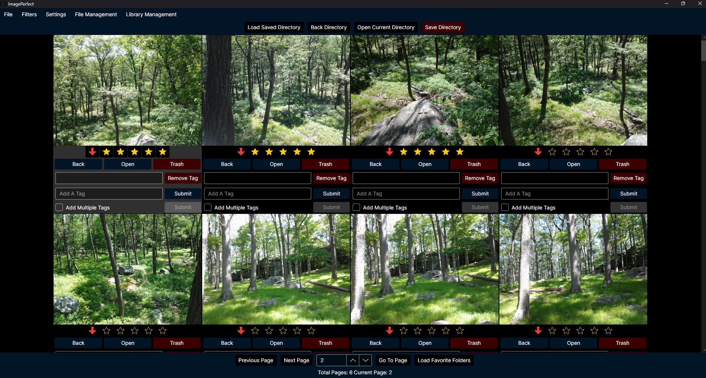

### Image Close Up

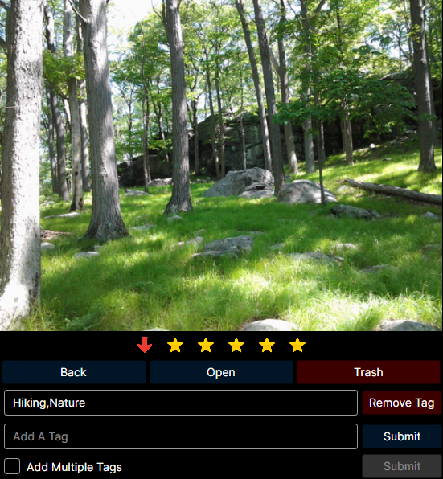

### Folders Page

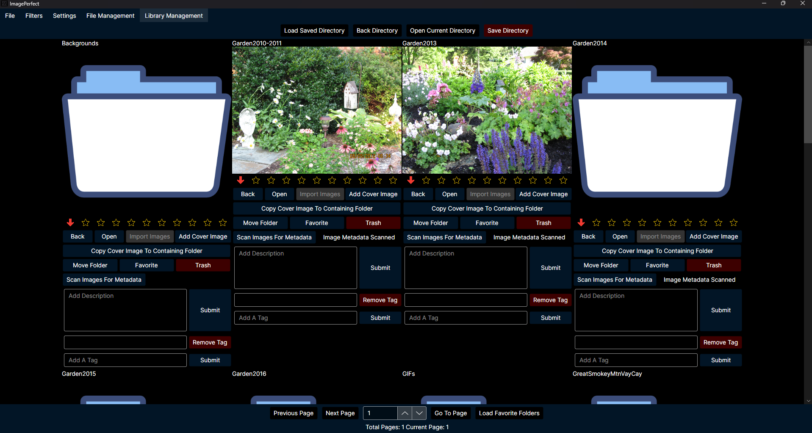

### Folder Close Up


<a id="mysql-server-setup-windows"></a>
## 🖥️ MySQL Server Setup Windows

Image Perfect requires a local MySQL 8.0+ server. Follow the instructions below based on whether you’re a **developer** or an **end user**.

---

<a id="mysql-server-setup-windows-developers"></a>
### 🛠️ Windows Development

> 📌 **Note**: Follow these steps if you're a developer who wants to **modify or contribute** to ImagePerfect.

- Download the [MySQL MSI Installer (8.0+)](https://dev.mysql.com/downloads/installer/).
- Run `mysql-installer-community-8.0.42.0.msi`.
- Choose **Full Setup**, then click **Next** and **Execute**
- Continue through the installation, accepting the default settings:
	+ Type and Networking  
     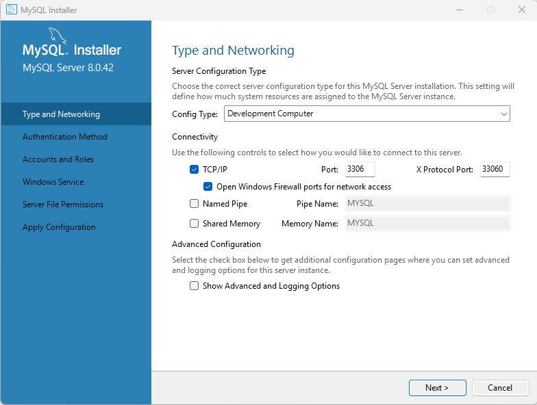
	+ Authentication Method  
     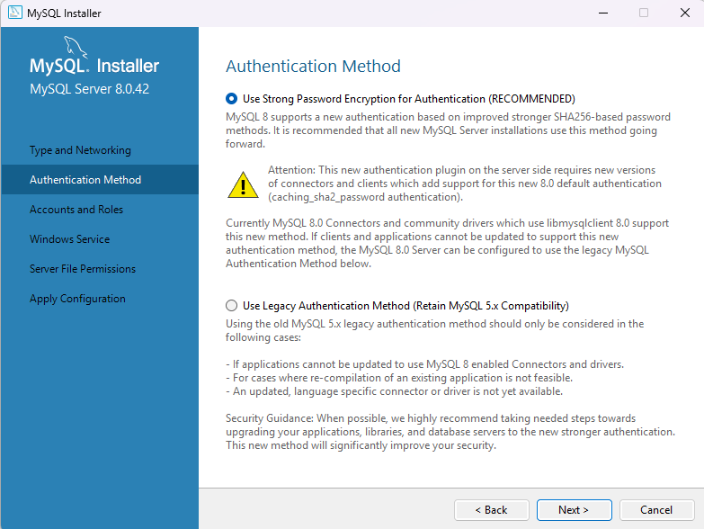
	+ Accounts and Roles  
     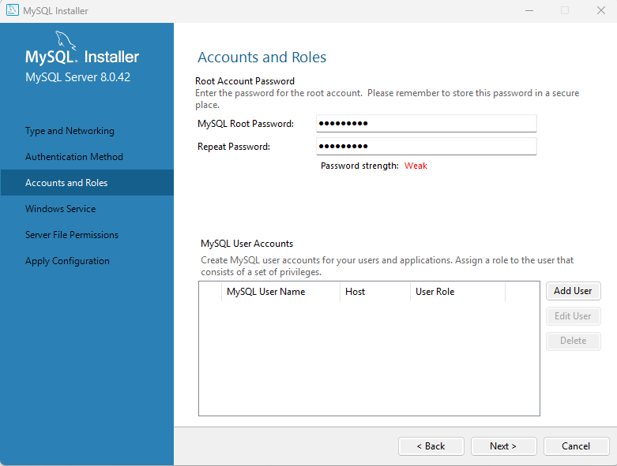  
     💡 Keep your password safe!
	+ Windows Service  
     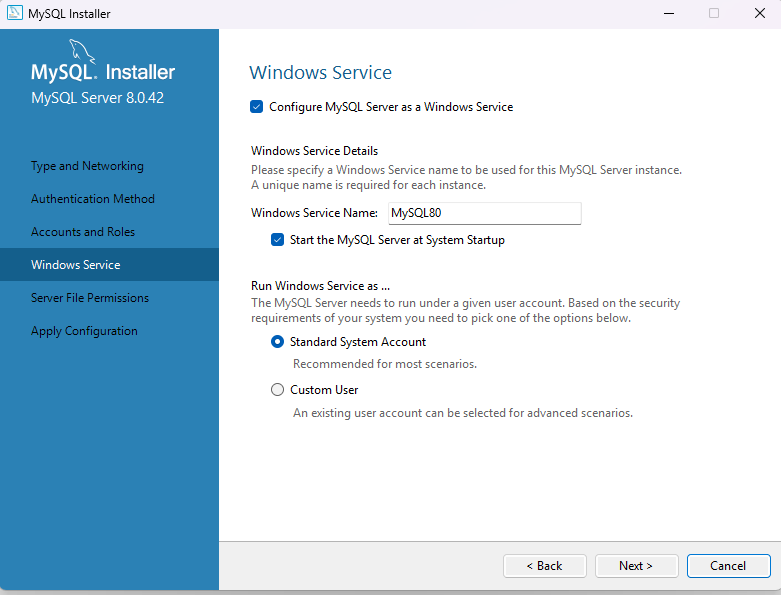
	+ Server File Permissions  
     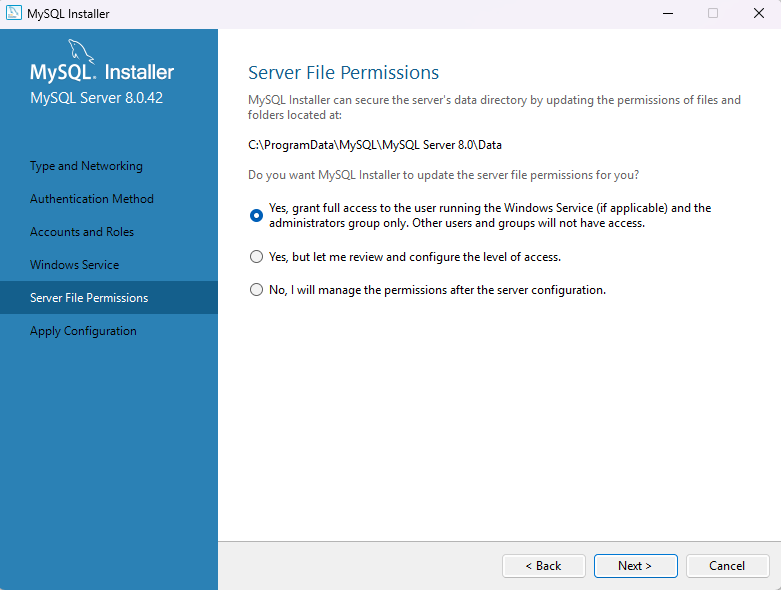
	+ Apply Configuration → **Execute**
	
- After installation, MySQL Workbench and Shell should open automatically.

> ✅ **Next Step:** Open **MySQL Command Line Client** and run the [SQL commands](#create-database-commands) below to set up the database schema.

---

<a id="create-database-commands"></a>

```sql
-- Create database
CREATE DATABASE imageperfect;
USE imageperfect;

-- Folders table
CREATE TABLE `folders` (
  `FolderId` bigint unsigned NOT NULL AUTO_INCREMENT,
  `FolderName` varchar(200) NOT NULL,
  `FolderPath` varchar(2000) NOT NULL,
  `HasChildren` tinyint(1) DEFAULT NULL,
  `CoverImagePath` varchar(2000) DEFAULT NULL,
  `FolderDescription` varchar(3000) DEFAULT NULL,
  `FolderRating` tinyint unsigned DEFAULT NULL,
  `HasFiles` tinyint(1) DEFAULT NULL,
  `IsRoot` tinyint(1) DEFAULT NULL,
  `FolderContentMetaDataScanned` tinyint(1) DEFAULT NULL,
  `AreImagesImported` tinyint(1) DEFAULT NULL,
  PRIMARY KEY (`FolderId`),
  FULLTEXT KEY `fulltext` (`FolderName`,`FolderPath`,`FolderDescription`)
) ENGINE=InnoDB DEFAULT CHARSET=utf8mb4 COLLATE=utf8mb4_0900_ai_ci;

-- Images table
CREATE TABLE `images` (
  `ImageId` bigint unsigned NOT NULL AUTO_INCREMENT,
  `ImagePath` varchar(2000) NOT NULL,
  `FileName` varchar(500) NOT NULL,
  `ImageRating` tinyint unsigned DEFAULT NULL,
  `ImageFolderPath` varchar(2000) NOT NULL,
  `ImageMetaDataScanned` tinyint(1) DEFAULT NULL,
  `FolderId` bigint unsigned DEFAULT NULL,
  `DateTaken` date DEFAULT NULL,
  `DateTakenYear` smallint GENERATED ALWAYS AS (year(`DateTaken`)) STORED,
  `DateTakenMonth` tinyint GENERATED ALWAYS AS (month(`DateTaken`)) STORED,
  `DateTakenDay` tinyint GENERATED ALWAYS AS (dayofmonth(`DateTaken`)) STORED,
  PRIMARY KEY (`ImageId`),
  KEY `FolderId` (`FolderId`),
  KEY `idx_date_parts` (`DateTakenYear`,`DateTakenMonth`,`DateTakenDay`),
  FULLTEXT KEY `fulltext` (`ImagePath`),
  CONSTRAINT `images_ibfk_1` FOREIGN KEY (`FolderId`) REFERENCES `folders` (`FolderId`) ON DELETE CASCADE ON UPDATE CASCADE
) ENGINE=InnoDB DEFAULT CHARSET=utf8mb4 COLLATE=utf8mb4_0900_ai_ci;

-- Image dates table
CREATE TABLE `image_dates` (
  `DateTaken` date NOT NULL,
  `Year` smallint NOT NULL,
  `Month` tinyint NOT NULL,
  `Day` tinyint NOT NULL,
  `YearMonth` char(7) GENERATED ALWAYS AS (concat(`Year`,_utf8mb4'-',lpad(`Month`,2,_utf8mb4'0'))) STORED,
  PRIMARY KEY (`DateTaken`),
  KEY `idx_year` (`Year`),
  KEY `idx_month` (`Month`),
  KEY `idx_year_month` (`YearMonth`)
) ENGINE=InnoDB DEFAULT CHARSET=utf8mb4 COLLATE=utf8mb4_0900_ai_ci;

-- Tags table
CREATE TABLE `tags` (
  `TagId` bigint unsigned NOT NULL AUTO_INCREMENT,
  `TagName` varchar(100) NOT NULL,
  PRIMARY KEY (`TagId`),
  UNIQUE KEY `tags_uq` (`TagName`)
) ENGINE=InnoDB DEFAULT CHARSET=utf8mb4 COLLATE=utf8mb4_0900_ai_ci;

-- Folder-Tags join table
CREATE TABLE `folder_tags_join` (
  `FolderId` bigint unsigned NOT NULL,
  `TagId` bigint unsigned NOT NULL,
  PRIMARY KEY (`FolderId`,`TagId`),
  KEY `folder_tags_join_idfk_2` (`TagId`),
  CONSTRAINT `folder_tags_join_idfk_1` FOREIGN KEY (`FolderId`) REFERENCES `folders` (`FolderId`) ON DELETE CASCADE ON UPDATE CASCADE,
  CONSTRAINT `folder_tags_join_idfk_2` FOREIGN KEY (`TagId`) REFERENCES `tags` (`TagId`) ON DELETE CASCADE ON UPDATE CASCADE
) ENGINE=InnoDB DEFAULT CHARSET=utf8mb4 COLLATE=utf8mb4_0900_ai_ci;

-- Image-Tags join table
CREATE TABLE `image_tags_join` (
  `ImageId` bigint unsigned NOT NULL,
  `TagId` bigint unsigned NOT NULL,
  PRIMARY KEY (`ImageId`,`TagId`),
  KEY `image_tags_join_ibfk_2` (`TagId`),
  CONSTRAINT `image_tags_join_ibfk_1` FOREIGN KEY (`ImageId`) REFERENCES `images` (`ImageId`) ON DELETE CASCADE ON UPDATE CASCADE,
  CONSTRAINT `image_tags_join_ibfk_2` FOREIGN KEY (`TagId`) REFERENCES `tags` (`TagId`) ON DELETE CASCADE ON UPDATE CASCADE
) ENGINE=InnoDB DEFAULT CHARSET=utf8mb4 COLLATE=utf8mb4_0900_ai_ci;

-- Settings table
CREATE TABLE `settings` (
  `SettingsId` enum('1') NOT NULL,
  `MaxImageWidth` int unsigned NOT NULL,
  `FolderPageSize` int unsigned NOT NULL,
  `ImagePageSize` int unsigned NOT NULL,
  `ExternalImageViewerExePath` varchar(2000) DEFAULT NULL,
  `FileExplorerExePath` varchar(2000) DEFAULT NULL,
  PRIMARY KEY (`SettingsId`)
) ENGINE=InnoDB DEFAULT CHARSET=utf8mb4 COLLATE=utf8mb4_0900_ai_ci;

INSERT INTO settings (MaxImageWidth, FolderPageSize, ImagePageSize) VALUES (500, 20, 60); 

-- Folder Saved Favorites
CREATE TABLE `folder_saved_favorites` (
  `SavedId` bigint unsigned NOT NULL AUTO_INCREMENT,
  `FolderId` bigint unsigned DEFAULT NULL,
  PRIMARY KEY (`SavedId`),
  UNIQUE KEY `folderid_uq` (`FolderId`)
) ENGINE=InnoDB DEFAULT CHARSET=utf8mb4 COLLATE=utf8mb4_0900_ai_ci;

-- Saved Directory Table
CREATE TABLE `saved_directory` (
  `SavedDirectoryId` enum('1') NOT NULL,
  `SavedDirectory` varchar(2000) NOT NULL,
  `SavedFolderPage` int unsigned NOT NULL,
  `SavedTotalFolderPages` int unsigned NOT NULL,
  `SavedImagePage` int unsigned NOT NULL,
  `SavedTotalImagePages` int unsigned NOT NULL,
  `XVector` double NOT NULL,
  `YVector` double NOT NULL,
  PRIMARY KEY (`SavedDirectoryId`)
) ENGINE=InnoDB DEFAULT CHARSET=utf8mb4 COLLATE=utf8mb4_0900_ai_ci;

INSERT INTO saved_directory (SavedDirectory, SavedFolderPage, SavedTotalFolderPages, SavedImagePage, SavedTotalImagePages, XVector, YVector) VALUES ("",1,1,1,1,0,0);

-- Enable local file import
SET PERSIST local_infile = 1;

```

	
> 📌 **Important**: Make sure to run `SET PERSIST local_infile = 1;` or file importing won't work.

---

<a id="mysql-server-setup-windows-end-user"></a>
### 🧑‍💻 For Windows End Users

> 📌 **Note**: Use this setup if you only plan to **run** Image Perfect without contributing to the codebase.

- Download the [MySQL MSI Installer (8.0+)](https://dev.mysql.com/downloads/installer/).
- Run `mysql-installer-community-8.0.42.0.msi`.
- Choose **Server Only**, then click **Next** and **Execute**.
- Use the following configuration options:
	+ Type and Networking (set Config Type to **Manual**)  
     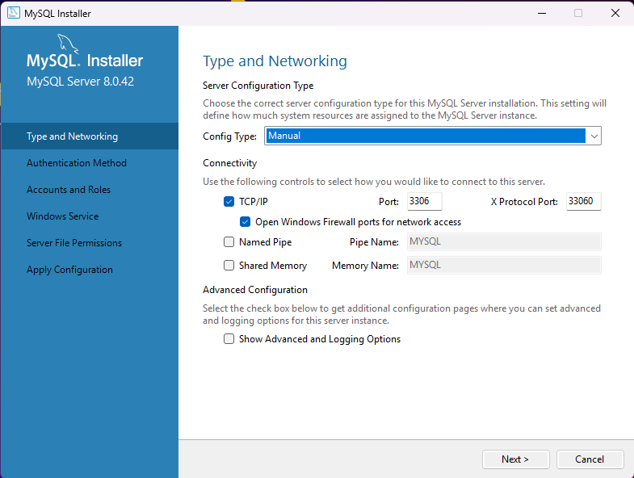
	+ Authentication Method  
     
	+  Accounts and Roles  
       
     💡 Save your password!
	+ Windows Service  
     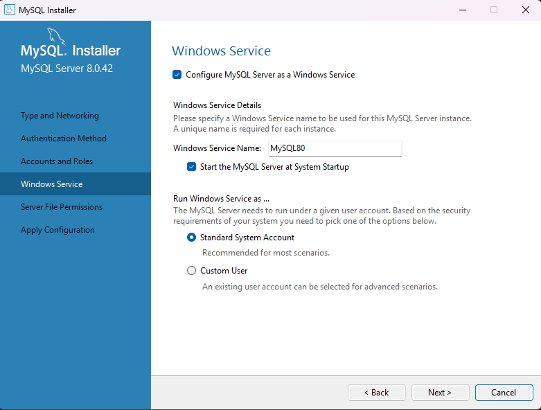
	+ Server File Permissions  
     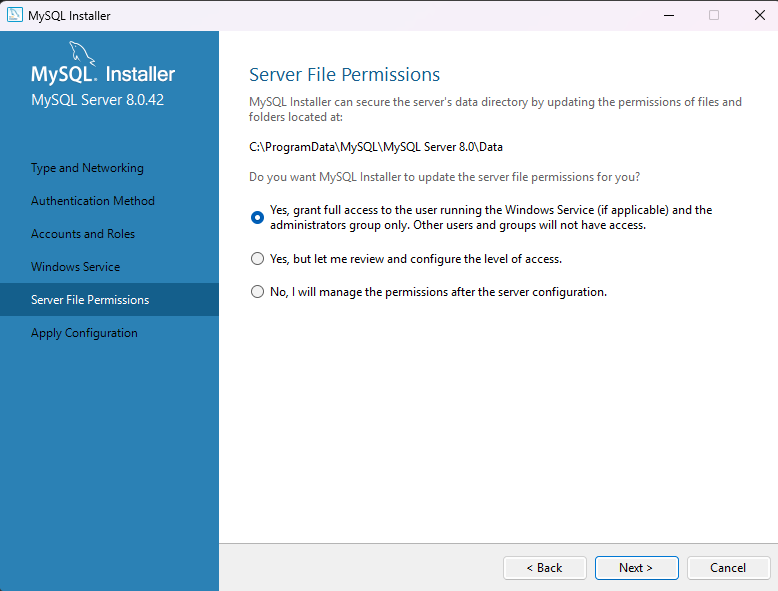
	+ Apply Configuration → **Execute**
	
- Continue through the installer keeping default settings

> 📌 **Note**: Choosing **Manual** setup allows later configuration of MySQL memory usage via `my.ini` (located at `C:\ProgramData\MySQL\MySQL Server 8.0`). Learn more [here](https://dev.mysql.com/doc/mysql-installer/en/server-type-network.html). The defaults should work fine for most users.

---

> ✅ Once MySQL is installed, open **MySQL Command Line Client** and run the [database setup commands](#create-database-commands).  
> ✅ When that's complete, you're ready to run Image Perfect!

<a id="mysql-server-setup-linux"></a>
## 🖥️ MySQL Server Setup Ubuntu

Image Perfect requires a local MySQL 8.0+ server.

---

📋 Temporary Instructions

Full step-by-step setup directions for Ubuntu are coming soon.
For now, here’s the basic outline:

1. **Install MySQL**:
```
sudo apt update
sudo apt install mysql-server

```
2. **Set up users**
	- Configure your root password.
	- Create a dedicated ImagePerfect user with full access to the imageperfect database.
3. Run the [database setup commands](#create-database-commands).

📚 **Helpful Resource**:


I recommend following this guide:
[How To Install MySQL on Ubuntu 22.04 (DigitalOcean)](https://www.digitalocean.com/community/tutorials/how-to-install-mysql-on-ubuntu-22-04)

> This guide is written for Ubuntu Server, but the steps are nearly identical on a regular desktop install.

<a id="build-and-install-directions"></a>
## 📋 Build And Install Directions

> 📌 **First, ensure MySQL Server is set up and running.**

- Clone this repository
```
git clone https://github.com/BitForgeCraftedCode/ImagePerfect.git
```

### Windows
- Open solution file in Visual Studio
- Right click on project file and click publish
- Set up your publish profile
	- Select local folder publish
	- Configuration: Release | Any CPU
	- Target framework: net8.0
	- Deployment mode: Self-contained
	- Target runtime: win-x64

Then to run the application double click on ImagePerfect.exe or you could also right click the exe and send to desktop as a shortcut.

> 📌 **Note**: If your MySql password (pwd) and user (uid) differs from what is in the appsettings.json file in this repository. You must change it.

```
{
  "ConnectionStrings": {
    "DefaultConnection": "server=127.0.0.1;uid=root;pwd=your-password;database=imageperfect;AllowLoadLocalInfile=true"
  }
}
```

> 🔐 **Security Note**: Never commit your real MySQL credentials to source control.

### Ubuntu
- Open solution file in Visual Studio
- Right click on project file and click publish
- Set up your publish profile
	- Select local folder publish
	- Configuration: Release | Any CPU
	- Target framework: net8.0
	- Deployment mode: Self-contained
	- Target runtime: linux-x64
	
Copy the publish files from your Windows PC to your Linux one. Or just use JetBrains Rider in Linux. The steps will be almost the same.

Then to run just open terminal in the build folder and run this command
```
./ImagePerfect
```

> 📌 **Note**: If your MySql password (pwd) and user (uid) differs from what is in the appsettings.json file in this repository. You must change it.

```
{
  "ConnectionStrings": {
    "DefaultConnection": "server=127.0.0.1;uid=root;pwd=your-password;database=imageperfect;AllowLoadLocalInfile=true"
  }
}
```

> 🔐 **Security Note**: Never commit your real MySQL credentials to source control.

<a id="backing-up-and-restoring-the-mysql-database"></a>
## 📊 Backing Up And Restoring The MySQL Database

### Windows
We will use mysqldump command to do this.

**Important:** ImagePerfect stores file paths in the database, so your image files must remain in the **same locations** (drive letter, folder paths, etc.) for a restore to work.

1. Open **Command Prompt** (not PowerShell) and navigate to your MySQL bin directory:
```
cd C:\Program Files\MySQL\MySQL Server 8.0\bin
```
2. **To backup**: 
```
mysqldump -u root -p imageperfect > C:\MySQLBackup\imageperfect_YYYY_MM_DD.sql
```

- It will ask for your root server password after hitting enter.
- Your backup SQL file will now be in C:\MySQLBackup check and ensure it is there.


3. **To restore**:
```
mysql -u root -p imageperfect < C:\MySQLBackup\imageperfect_YYYY_MM_DD.sql
```

- It will ask for your root server password after hitting enter.
- Your database should now be restored.
	
NOTE: It would be best to try this before spending too much time organizing your photos in the app. Make sure you can backup before wasting time. It's easy to spend hours adding cover images, tags, and notes about the event/day.

### Ubuntu

This is basically the same as Windows

1. Open a terminal in your desired backup location.
2. **To backup**:
```
sudo mysqldump imageperfect > imageperfect_YYYY_MM_DD.sql
```

- Ubuntu will ask for your root password after hitting enter.
- This will dump the imageperfect database in the backup location.
	
3. **To restore**:
```
sudo mysql imageperfect < imageperfect_YYYY_MM_DD.sql
```

- Ubuntu will ask for your root password after hitting enter.
- Your database should now be restored.
- Obvious or maybe not, but terminal should be opened in the location/folder where your backup file is located for the restore to work.

<a id="migrating-to-a-new-computer"></a>
## 📦 Migrating To A New Computer

- Install and configure MySQL then build the app as usual
- Restore the database as described above
- Ensure all image files are restored to the **same location and drive letter/path** as before

<a id="license"></a>
## 🪪 License

**Image Perfect** is licensed under the **GNU Affero General Public License v3.0 (AGPL-3.0)**.

You are free to use, modify, and distribute this software under the terms of the AGPL. If you modify and publicly distribute the software — including via a hosted service — you must make your source code available under the same license.

<a id="feedback-and-contributions"></a>
## 📢 Feedback And Contributions

I'm always open to feedback, feature suggestions, or contributions. Please feel free to open issues or pull requests.

> 🙌 Support Development
If you find Image Perfect helpful, consider starring the repository ⭐, opening issues with feedback, or contributing code.
As the project grows, I may offer a paid Pro tier to support sustainable development — but the core project will remain free and open source for everyone.


 


