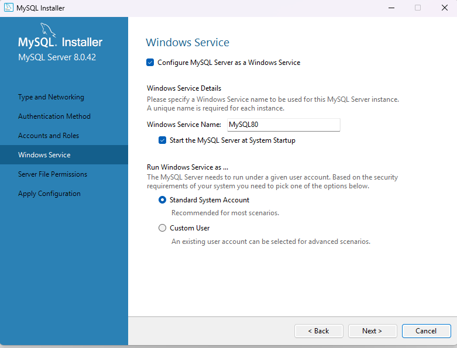
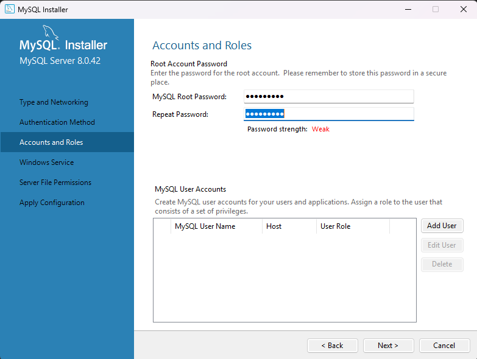
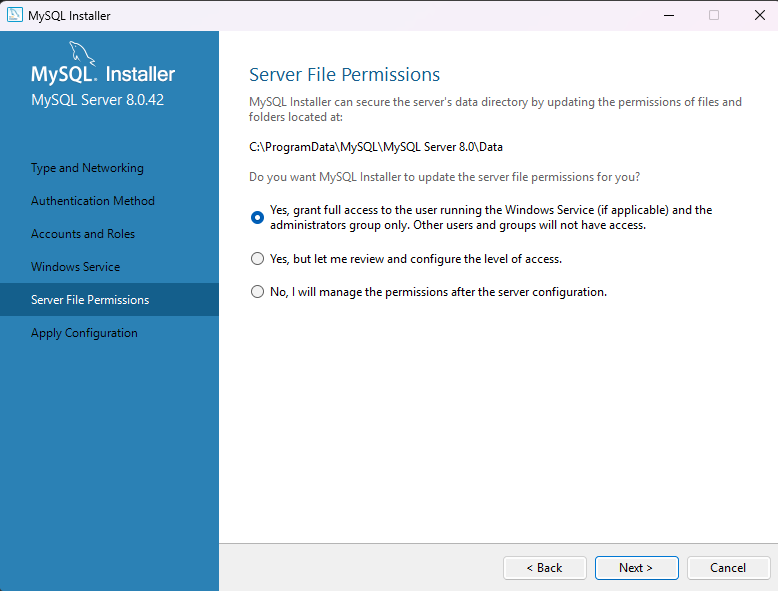

## 🖥️ MySQL Server Setup Windows

Image Perfect requires a local MySQL 8.0+ server. Follow the instructions below based on whether you’re a **developer** or an **end user**.

---

### 🛠️ Windows Development

> 📌 **Note**: Follow these steps if you're a developer who wants to **modify or contribute** to ImagePerfect.

- Download the [MySQL MSI Installer (8.0+)](https://dev.mysql.com/downloads/installer/).
- Run `mysql-installer-community-8.0.42.0.msi`.
- Choose **Full Setup**, then click **Next** and **Execute**
- Continue through the installation, accepting the default settings:
	+ Type and Networking  
     
	+ Authentication Method  
     
	+ Accounts and Roles  
       
     💡 Keep your password safe!
	+ Windows Service  
     
	+ Server File Permissions  
     
	+ Apply Configuration → **Execute**
	
- After installation, MySQL Workbench and Shell should open automatically.

> ✅ **Next Step:** Open **MySQL Command Line Client** and run the [SQL commands](CREATE_DATABASE_COMMANDS.md) below to set up the database schema.

### 🧑‍💻 For Windows End Users

> 📌 **Note**: Use this setup if you only plan to **run** Image Perfect without contributing to the codebase.

- Download the [MySQL MSI Installer (8.0+)](https://dev.mysql.com/downloads/installer/).
- Run `mysql-installer-community-8.0.42.0.msi`.
- Choose **Server Only**, then click **Next** and **Execute**.
- Use the following configuration options:
	+ Type and Networking (set Config Type to **Manual**)  
     
	+ Authentication Method  
     
	+  Accounts and Roles  
       
     💡 Save your password!
	+ Windows Service  
     
	+ Server File Permissions  
     
	+ Apply Configuration → **Execute**
	
- Continue through the installer keeping default settings

> 📌 **Note**: Choosing **Manual** setup allows later configuration of MySQL memory usage via `my.ini` (located at `C:\ProgramData\MySQL\MySQL Server 8.0`). Learn more [here](https://dev.mysql.com/doc/mysql-installer/en/server-type-network.html). The defaults should work fine for most users.

---

> ✅ Once MySQL is installed, open **MySQL Command Line Client** and run the [database setup commands](CREATE_DATABASE_COMMANDS.md).  
> ✅ When that's complete, you're ready to run Image Perfect!